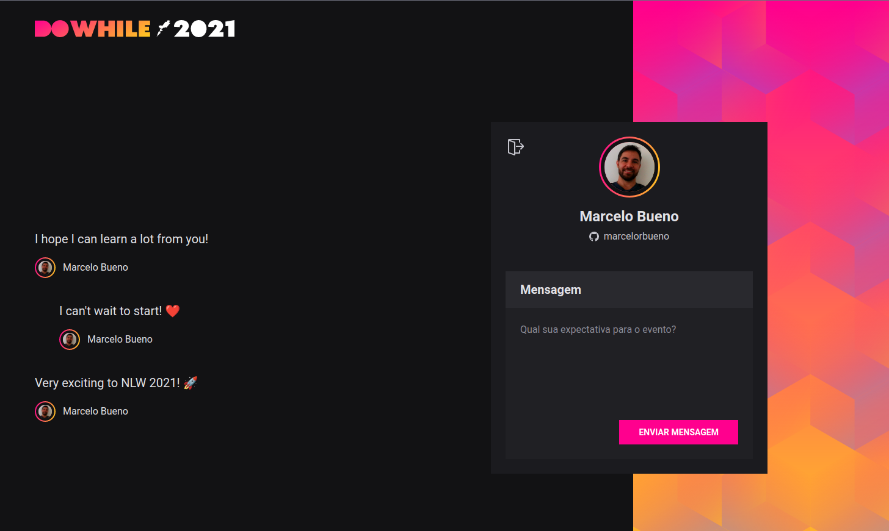

<h1 align="center">Welcome to NLW Heat 2021 👋</h1>
<p>
  
  
  
  <a href="https://github.com/marcelorbueno/nlw-heat-2021#readme" target="_blank">
    
  </a>
  <a href="https://github.com/kefranabg/readme-md-generator/graphs/commit-activity" target="_blank">
    
  </a>
  <a href="https://github.com/marcelorbueno/nlw-heat-2021/blob/main/LICENSE" target="_blank">
    
  </a>
  <a href="https://twitter.com/marcelorezbueno" target="_blank">
    
  </a>
</p>

> Repositório que contém os códigos da aplicação construída durante o NLW Heat 2021.

### 🏠 [Homepage](https://github.com/marcelorbueno/nlw-heat-2021#readme)

## Prerequisites

- npm >=5.5.0
- node >=9.3.0

## Techmologies

- ReactJS
- NodeJS
- Prisma
- Github Authentication
- Typescript

## Screenshots

### Authentication view:


### Index View:



## Install

```sh
# Clone this repository
$ git clone https://github.com/marcelorbueno/nlw-heat-2021

# Go into frontend module
$ cd web

# Install dependencies
$ yarn

# Go into backend module
$ cd ../backend

# Install dependencies
$ yarn

# Set values to .env fields
# More info at https://docs.github.com/pt/rest/guides/basics-of-authentication
GITHUB_CLIENT_SECRET=
GITHUB_CLIENT_ID=

# Preference large random alpha numeric value
JWT_SECRET=

# Run Prisma Migrations
$ yarn prisma migrate dev
```

## Usage

```sh
# Go into frontend module
$ cd web

# Install dependencies
$ yarn dev

# Go into backend module
$ cd ../backend

# Install dependencies
$ yarn dev
```

- Run in:\
  <http://localhost:3000>

## Run tests

```sh
yarn test
```

## Author

👤 **Marcelo Bueno**

- Website: http://marcelorbueno.com
- Twitter: [@marcelorezbueno](https://twitter.com/marcelorezbueno)
- Github: [@marcelorbueno](https://github.com/marcelorbueno)

## Show your support

Give a ⭐️ if this project helped you!

## 📝 License

Copyright © 2021 [Marcelo Bueno](https://github.com/marcelorbueno).<br />
This project is [MIT](https://github.com/marcelorbueno/nlw-heat-2021/blob/main/LICENSE) licensed.

---

_This README was generated with ❤️ by [readme-md-generator](https://github.com/kefranabg/readme-md-generator)_
